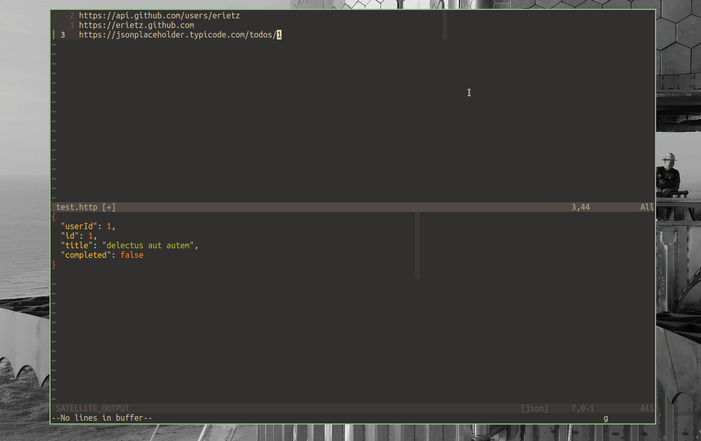

# OBSOLETE !!!!

I just found [rest.nvim](https://github.com/NTBBloodbath/rest.nvim) which
already did everything that I wanted.

Primitive example: 

Inspiration: [Satellite of Love](https://www.youtube.com/watch?v=KFbgAxxVh1E)
